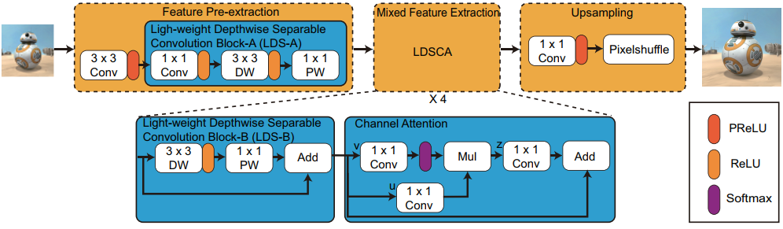
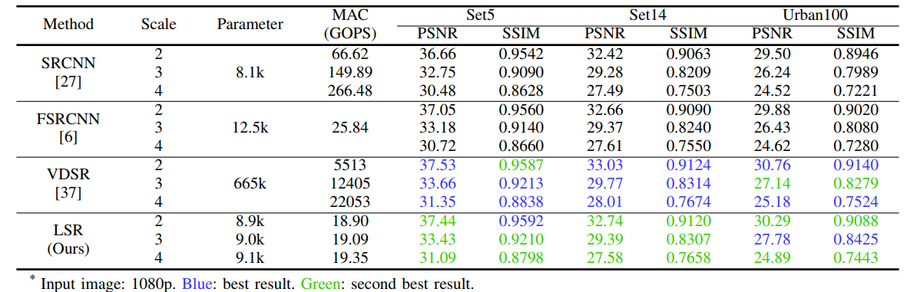

# HDSuper: Algorithm-Hardware Co-design for Light-weight High-quality Super-Resolution Accelerator

[Liang Chang](https://scholar.google.com.hk/citations?hl=zh-CN&user=5pWnfJcAAAAJ), [Xin Zhao](https://orcid.org/0009-0002-6468-9364), [Dongqi Fan](https://scholar.google.com.hk/citations?user=P7gt5XYAAAAJ&hl=zh-CN), ZhiCheng Hu, and [Jun Zhou](https://scholar.google.com.hk/citations?hl=zh-CN&user=kWeqfrMAAAAJ)

This repository is the official implementation of  ["HDSuper: Algorithm-Hardware Co-design for Light-weight High-quality Super-Resolution Accelerator"](https://ieeexplore.ieee.org/abstract/document/10247683). 

## Architecture




## Results




## Citation

```
@inproceedings{chang2023hdsuper,
  title={HDSuper: Algorithm-Hardware Co-design for Light-weight High-quality Super-Resolution Accelerator},
  author={Chang, Liang and Zhao, Xin and Fan, Dongqi and Hu, Zhicheng and Zhou, Jun},
  booktitle={2023 60th ACM/IEEE Design Automation Conference (DAC)},
  pages={1--6},
  year={2023},
  organization={IEEE}
}
```


If you have any question, please contact dongqifan@std.uestc.edu.cn

